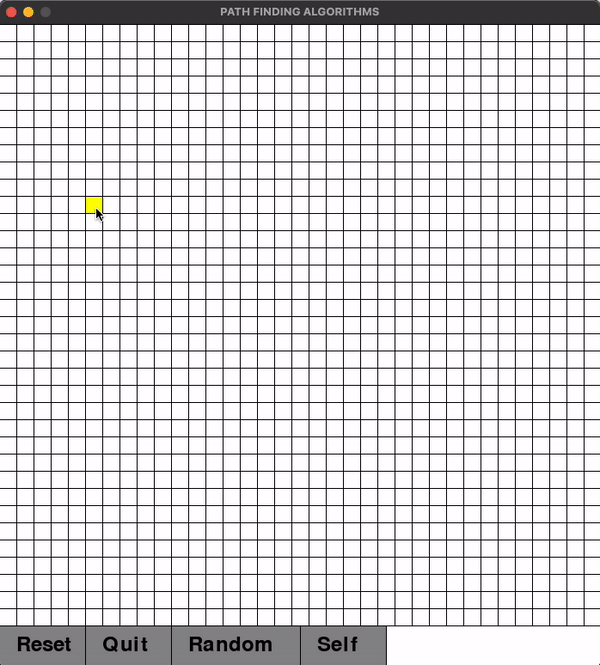
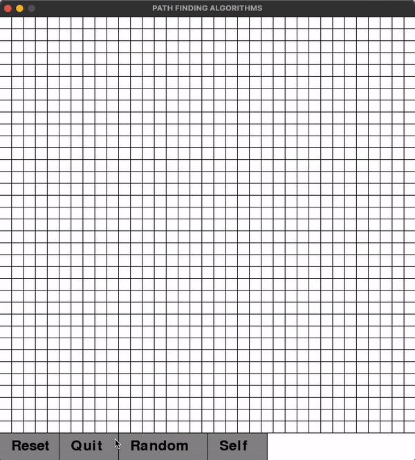

# A-Star Algorithm Visualizer

Pygame based easy-to-use interactive visualizer for A-Star Path Finding Algorithm.

## Demo

### Manual Mode



### Random Mode



Color Code:

- `Yellow`: Start Node
- `Pink`  : End Node
- `Red`   : Closed Node
- `Green` : Open Node
- `Blue`  : Final Path
- `Black` : Obstacles

## Requirements

``` bash
pip install pygame
```

## Installation

``` bash
git clone https://github.com/mradul2/astar-visualizer.git
```

## Usage

``` bash
python3 main.py
```

1. Select the `Random` mode for creating random obstacles.
2. Use the GUI for creating `start`, `end` and `obtacle` nodes in order.
3. `Left-Click` to create and `Right-click` to delete any Node.
4. Press `Enter` to initiate the visualizer.
5. Press `Reset` to clear the visualizer or `Quit` to exit.